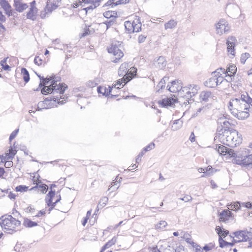
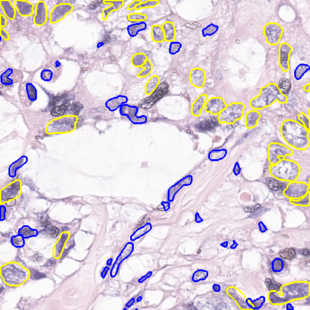
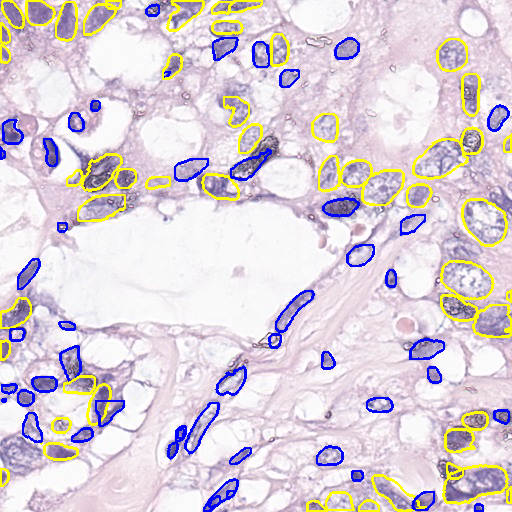
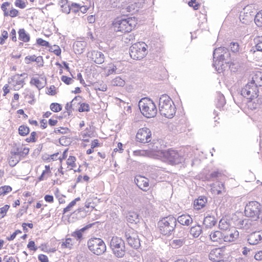
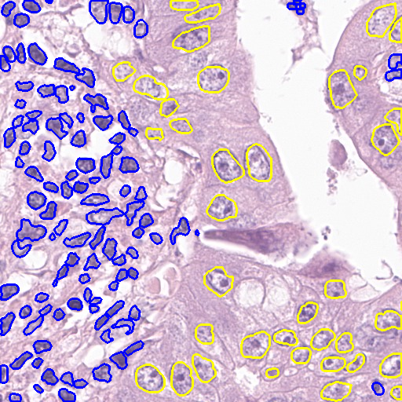
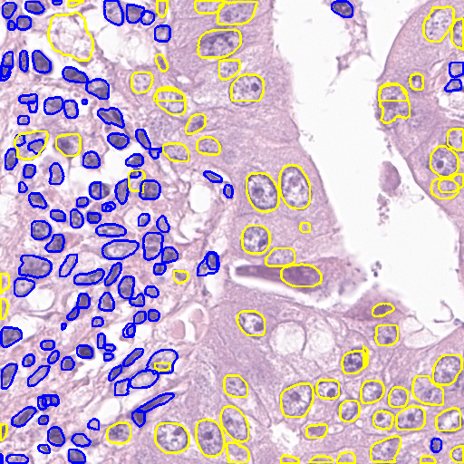

# README

Boosting Predictive Accuracy in Tumor Cellularity Evaluation with AI-Powered Ensemble Methods

An ensemble Mask R-CNN model with data augmentation was proposed to identify the tumor and non-tumor nucleus. 


## Set Up Environment
This algorithm was implemented by using python 3.6.11 using Tensorflow 1.10.0 and Keras 2.2.4 on Linux system with 1 NVIDIA GeForce GTX 2080 Ti GPU.

## Running the code

### Pre-Processing
```crop_image.py``` is capable of dividing the image into 1/8 overlapping images, which is a patch sampling way.
- Set a path to the image directory
- Set a path to save the visualized image directory 

```normaling.py``` is capable of normalizing the image into the same color staining by using Macenko's method [[1]](https://ieeexplore.ieee.org/document/5193250). I set the maximum stain concentrations to [1.5 1.3].
- Set path to the image directory
- Set path to save the normalized image directory 


### Training
```
cd PAIP2023_maskrcnn/Mask_RCNN/samples/nucleus/
python3 nucleus_paip.py train --dataset=/path/to/dataset --subset=train --weights=imagenet
```
The training parameter is shown in ```nucleus_paip.py```.  The input size of training is set to 512×512. The pre-trained weight of the ImageNet ILSVRC 2012 dataset was used in the training phase. The SGD optimizer was used with a learning rate of 0.001. 


### Inference
```
python3 nucleus.py detect --dataset=/path/to/dataset --subset=train --weights=<last or /path/to/weights.h5>
```
- Load a custom model
- Set path to the input image directory
- Set path to the saved image directory 

### Post-Processing
```colorful_label.py``` is capable of drawing the tumor instances.

```knn_ping.py``` ```kmeans.py``` ```test_kmeans_knn.py``` ```test_knn_tung.py``` are capable of improving the predicted results, which methods are based on Kmeans or KNN algorithms.

```tta_new.py``` ```tta_npy.py``` are capable of being test time augmentation.

```visualize_img.py``` is capable of subplotting the figures.

## Result
| IMAGE                                           | GT                                             | PREDICTION                                      |
| ----------------------------------------------- | ---------------------------------------------- | ----------------------------------------------- |
|  |  |  |
|  |  |  |


## Color Reference

| Color             | RGB                                                                |
| ----------------- | ------------------------------------------------------------------ |
| Tumor cell |<span style="color:🟡">some *yellow* text</span> |
| Non-tumor cell |<span style="color:🔵">some *blue* text</span>|

## Reference
```
[1] Macenko, M., Niethammer, M., Marron, J. S., Borland, D., Woosley, J. T., Guan, X., ... & Thomas, N. E. (2009, June). A method for normalizing histology slides for quantitative analysis. In 2009 IEEE international symposium on biomedical imaging: from nano to macro (pp. 1107-1110). IEEE.
```
## Authors

- [@ChingPingWang](https://github.com/ChingPingWang)

